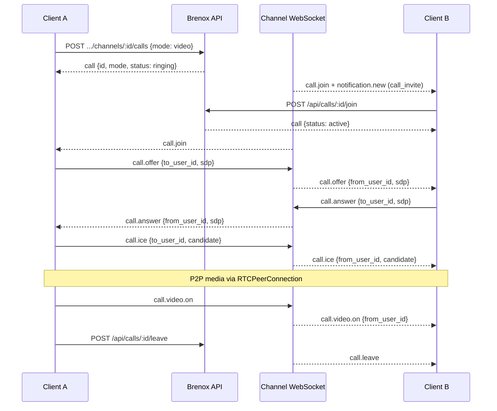

# WebRTC Client Requirements (SDK)

Guide for client/SDK teams integrating Brenox voice and video calls. The backend provides **signaling only** — all media (audio, video, screen share) flows peer-to-peer or via your TURN infrastructure.

## Prerequisites

| Requirement | Notes |
|-------------|-------|
| WebSocket connection | One per channel: `GET /api/ws?workspace_id=&channel_id=` |
| JWT auth | Header or `?token=` on upgrade URL |
| Channel membership | Required to initiate, join, or signal |
| STUN/TURN | Client-managed; see [WEBRTC.md](WEBRTC.md) |

## Call lifecycle



## Initiating calls

```http
POST /api/workspaces/:workspace_id/channels/:id/calls
Authorization: Bearer <token>
Content-Type: application/json

{"mode": "video"}
```

| Field | Values | Default |
|-------|--------|---------|
| `mode` | `voice`, `video` | `voice` |

Response includes `mode` so clients know whether to attach video tracks on join.

## WebRTC peer connection setup

1. Create `RTCPeerConnection` with ICE servers (STUN + TURN).
2. Add local tracks (`getUserMedia` for voice/video; `getDisplayMedia` for screen share).
3. On `icecandidate`, send `call.ice` to the remote peer via WebSocket.
4. Exchange SDP via `call.offer` / `call.answer` (mesh: each pair negotiates separately in group calls).

### Suggested client state

```typescript
interface CallSession {
  callId: number;
  mode: "voice" | "video";
  peers: Map<number, RTCPeerConnection>; // keyed by remote user_id
}
```

## Signaling events (client → server)

All require `call_id` in payload and active call participation.

| Event | Purpose |
|-------|---------|
| `call.offer` | SDP offer to `to_user_id` |
| `call.answer` | SDP answer to `to_user_id` |
| `call.ice` | ICE candidate to `to_user_id` |
| `call.video.on` | Camera enabled (broadcast) |
| `call.video.off` | Camera disabled (broadcast) |
| `call.screen.start` | Screen share started (broadcast) |
| `call.screen.stop` | Screen share stopped (broadcast) |
| `call.speaker.changed` | Active speaker changed (broadcast) |
| `call.recording.start` | Start recording metadata (persisted server-side) |
| `call.recording.stop` | Stop recording (`recording_id` required) |
| `call.preferences` | Codec/bandwidth hints (broadcast or targeted via `to_user_id`) |

Server adds `from_user_id` to all relayed payloads.

### Codec / bandwidth preferences (optional)

```json
{
  "type": "call.preferences",
  "payload": {
    "call_id": 1,
    "to_user_id": 2,
    "video_codec": "VP9",
    "max_bitrate_kbps": 1500,
    "simulcast": true
  }
}
```

Preferences are **advisory** — the server relays them but does not enforce codecs.

## Recording signaling

Recording stores **metadata only** (who started, when, optional JSON metadata). Media capture and storage are client-side.

**Start:**
```json
{
  "type": "call.recording.start",
  "payload": {
    "call_id": 1,
    "label": "team-standup",
    "storage": "s3://my-bucket/recordings/"
  }
}
```

Server responds by broadcasting with `recording_id` and `started_at`.

**Stop:**
```json
{
  "type": "call.recording.stop",
  "payload": {
    "call_id": 1,
    "recording_id": 5
  }
}
```

Only one active recording per call at a time.

## Video vs voice behavior

| Mode | Client should |
|------|---------------|
| `voice` | Audio tracks only; ignore `call.video.*` unless user toggles camera |
| `video` | Request camera on join; handle `call.video.on/off` from peers |

Toggling camera mid-call: send `call.video.on` / `call.video.off` regardless of initial mode.

## Screen sharing

Use `getDisplayMedia` client-side. Notify peers with `call.screen.start` / `call.screen.stop` so UIs can show a screen-share indicator. Replace or add video track on the existing `RTCPeerConnection` and renegotiate if needed.

## Active speaker

Optional UI enhancement. Client detects dominant audio (e.g. via Web Audio `AnalyserNode`) and sends:

```json
{
  "type": "call.speaker.changed",
  "payload": {
    "call_id": 1,
    "speaker_user_id": 3
  }
}
```

Debounce to ~2–5 updates per second to avoid flooding the channel.

## Limits

| Config | Env var | Default |
|--------|---------|---------|
| Max participants | `CALL_MAX_PARTICIPANTS` | 25 |

Join returns `409` when the call is full.

## Error handling

WebSocket errors for call events return `type: "error"` to the sender only:

```json
{
  "type": "error",
  "payload": { "message": "not a call participant" }
}
```

Common messages: `call channel mismatch`, `call has ended`, `call participant limit reached`, `call already has an active recording`.

## Multi-participant (mesh) calls

Brenox does not provide an SFU/MCU. For N participants, clients typically use a **mesh** topology (each pair exchanges offer/answer/ICE). For large groups, integrate an external SFU and use Brenox only for room membership and notifications.

## Testing checklist

- [ ] Voice call: offer/answer/ICE between two clients
- [ ] Video call: `mode: video` + camera tracks
- [ ] Toggle video mid-call (`call.video.on/off`)
- [ ] Screen share start/stop events
- [ ] Join rejected when call is full
- [ ] Recording start/stop with `recording_id`
- [ ] Leave/end cleans up peer connections

See also: [WEBRTC.md](WEBRTC.md), [WEBSOCKET_EVENTS.md](WEBSOCKET_EVENTS.md).
